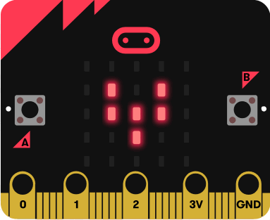

micro:bit Animation
--------------------
In this assignment you will program your own original animation using the micro:bit LED dispaly. Here is an example of animation that shows a beating heart:    
   
To code your animation you will us3 the functions `display.show()`, `Image()` and `sleep()`. Here's some sample code that makes a duck that moves up and down:
```python
from microbit import *

while True:
    display.show(Image(
        "09900:"
        "99900:"
        "09999:"
        "09990:"
        "00000"))
    sleep(500)
    display.show(Image(
        "00000:"
        "09900:"
        "99900:"
        "09999:"
        "09990"))
    sleep(500)
```
Each of the numbers 0 - 9 control the brightness of an LED on the display. 0 is fully off and 9 is fully lit. The `sleep()` function takes one argument that specifies how long in milliseconds the program will wait before it executes then next line of code. 1000 milliseconds is the same as 1 second.

Program requirements
-----------------
* Your program must use at least two original Images that you create
* Your program must use the `sleep()` function to animate the images
* You will need to submit the Python code and video (see below) in the form of an animated gif showing your program running

Suggested steps to completing this assignment
----------
1. TBD

Make a short video (under 10 seconds and smaller than 25MB)
-----------------------------------------------------------
When you are happy with your program, use your camera make a short video of you interacting with your virtual pet. The video need only your micro:bit running, please don't include anyone's face in the video. See the samples of student work below.   

Convert the video to an animated gif using a free converter like [ezgif.com](https://ezgif.com/). Use ezgif's *cut video* or a similar option to edit your video to under 10 seconds and less than 25MB. Submit your animated gif to Google Classroom. 

Samples of Student Work
----------
*none yet!*
